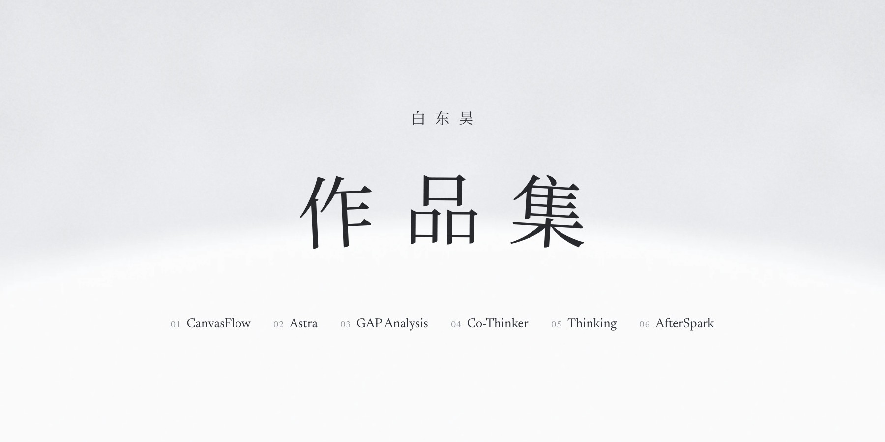
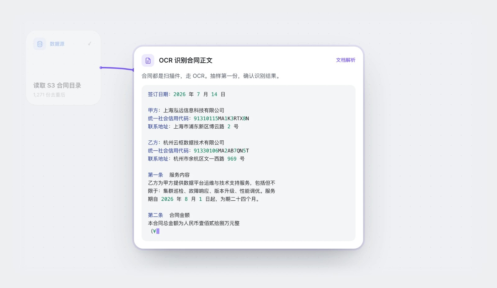
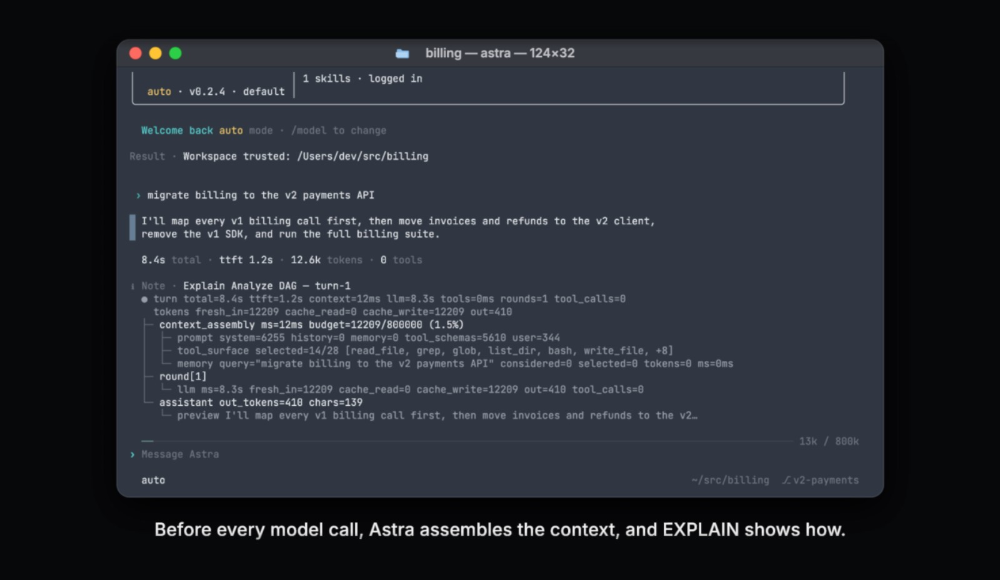
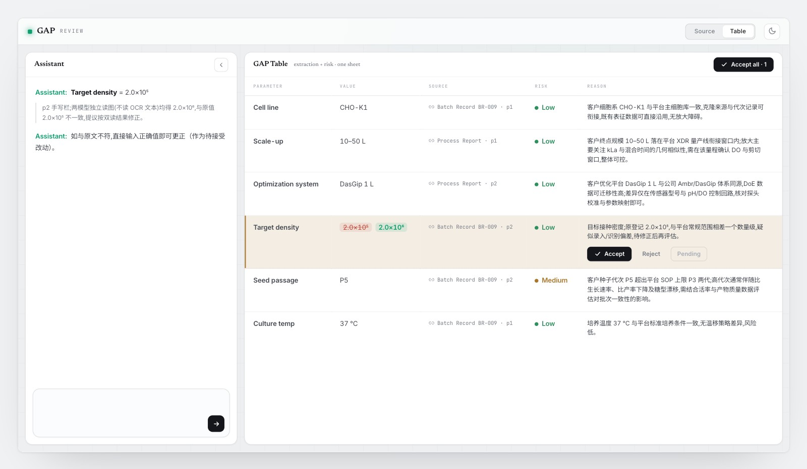
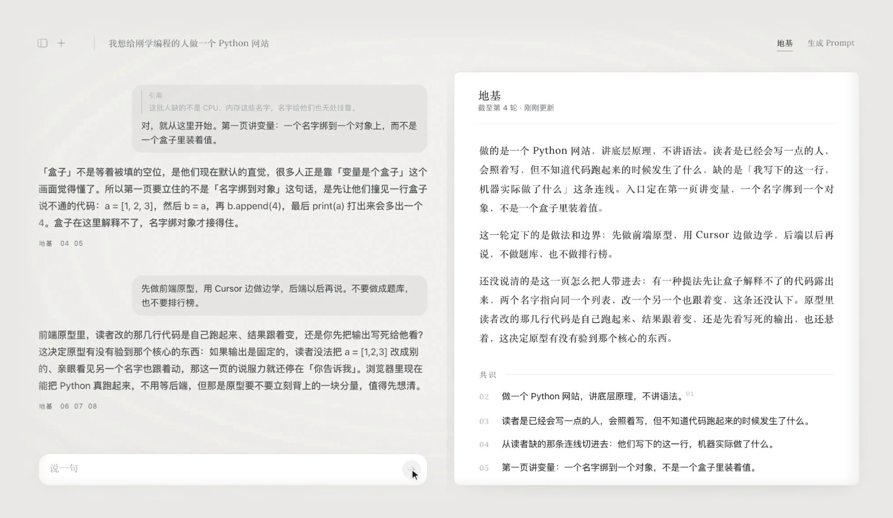
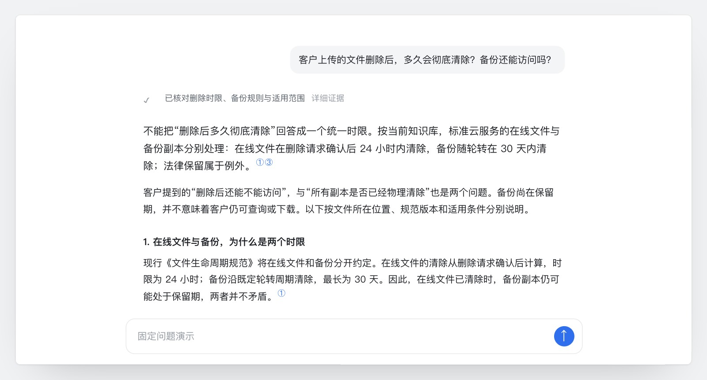

下载仓库（Code → Download ZIP），解压后用浏览器打开 dist 文件夹里的 index.html，就能看完整的网站：短片能播放，原型能操作，不需要联网。

## CanvasFlow

独立产品设计与实现

用自然语言构建数据工作流，在画布上核对、理解和修改。

计划先与用户对齐，节点随后逐个构建。代码在 [Bai-009/canvas-first-workflow](https://github.com/Bai-009/canvas-first-workflow)。

## Astra

矩阵起源 · 产品研究与概念影片创作

企业 Agent 运行时 · 概念宣传片

借鉴数据库的查询规划与 EXPLAIN，以一次支付系统迁移串起上下文的组装与追溯，呈现 Agent 围绕任务持续工作、延续判断依据的产品愿景。

## GAP Analysis

药明生物 · 企业 AI 解决方案

生物药工艺转移中的参数提取、专家核验与风险研判。同一历史项目的单客户参数提取，耗时从 50 小时以上降到约 20 分钟；业务专家评估的参数识别率在 90% 以上。

主导产品定义、系统架构与原型验证。

## Co-Thinker

独立产品设计与实现

在对话里把想法说清，定下来的沉进地基，需要时一键凝成 Prompt，交给执行。

地基在对话旁边一轮轮长出来。读完点一下，凝成一段能直接交出去的 Prompt。代码在 [Bai-009/Co-Thinker](https://github.com/Bai-009/Co-Thinker)。

## Thinking

信息架构与交互设计

按思路组织智能体的运行信息，完成后沿答案追溯依据。

切换行动时保留判断；切换判断时，所属执行信息一起退出。代码在 [Bai-009/agent-thinking-ui](https://github.com/Bai-009/agent-thinking-ui)。

## AfterSpark

独立产品 · AI 社交引荐

两个人所处的领域不同，却可能一直在思考相似的问题。AfterSpark 从长期对话中寻找这种联系，经多 Agent 审议和双方同意后，尝试把讨论带向共同交流。

## 经历与文章

**药明生物**　主导 GAP Analysis AI 解决方案的产品定义与系统架构，完成原型及 MVP 验证。

**矩阵起源**　端到端负责工作流模块的产品定义、交互设计与验收；参与平台体验迭代，设计智能体运行过程的信息呈现。

**产品研究**　YouWare、Kimi 与 AI 的现实应用。文章在 [Bai-009/ai-product-research](https://github.com/Bai-009/ai-product-research)。

---

[简历](dist/assets/resume.pdf)　·　[邮件联系](mailto:15234067089@163.com)
